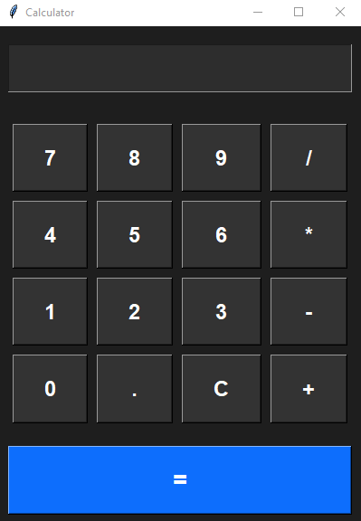

# <h1 align="center">🖩 Python GUI Calculator</h1>
A sleek, dark-themed Calculator built using Python Tkinter.
This application features a modern UI, smooth user interactions, and supports essential arithmetic operations.

---

## ✨ Features

- 🖤 **Dark Mode UI** for a clean and modern appearance.
- 🖱 **Hover Animations** for interactive user experience.
- 🧮 Supports **Addition (+)**, **Subtraction (−)**, **Multiplication (×)**, **Division (÷)**, and **Decimals**.
- 🛡 **Error Handling** with pop-up alerts for invalid input.
- 📏 **Responsive Layout** that adapts to different window sizes.

---

## 📸 Screenshot


<p align="center">
  
</p>

---

## 🚀 Getting Started

### Prerequisites
- **Python 3.x** installed on your system.

### Installation & Usage
1. Clone the repository:
   ```bash
   git clone https://github.com/yourusername/calculator-python-tkinter.git
   cd calculator-python-tkinter
   ```
2. Run the script:
   ```bash
   python main.py
   ```

---

## 📂 Project Structure
```
calculator-python-tkinter/
│
├── main.py           # Main calculator application code
├── Screenshot.png    # Screenshot of the application
└── README.md         # Project documentation
```

---

## 🧠 Learning Outcomes
- GUI development with Tkinter.
- Event handling & widget styling.
- Error handling & input validation.
- Designing responsive layouts.

---

## 📜 License
This project is licensed under the **[License: MIT](https://github.com/Kaif-T-200/CODSOFT_02_Python_Calculator/blob/main/LICENSE).** — feel free to use and modify it.

---

## 🔗 Connect with Me
- LinkedIn: [My LinkedIn Profile](https://www.linkedin.com/in/kaif-tarasgar-0b5425326/)
- X: [My X Profile](https://x.com/Kaif_T_200)
